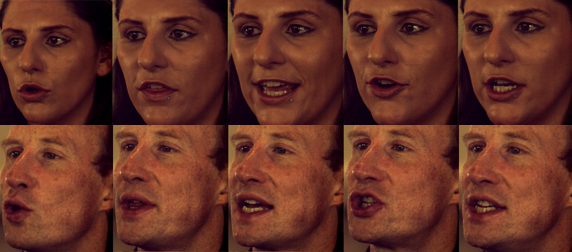
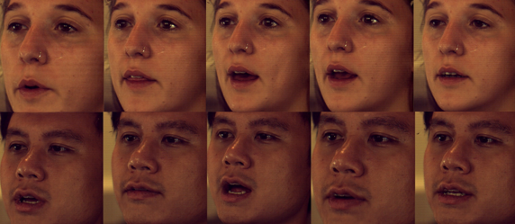
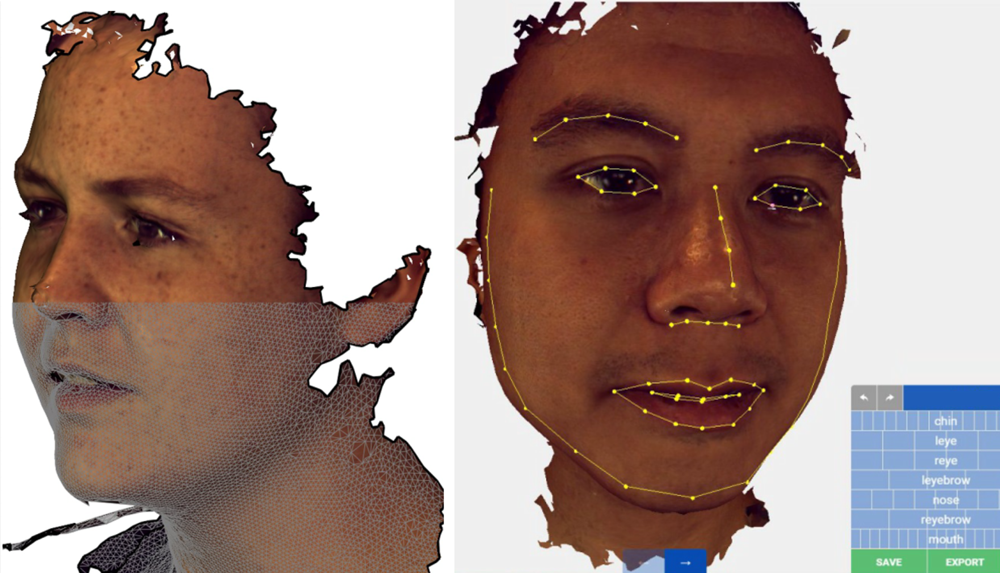
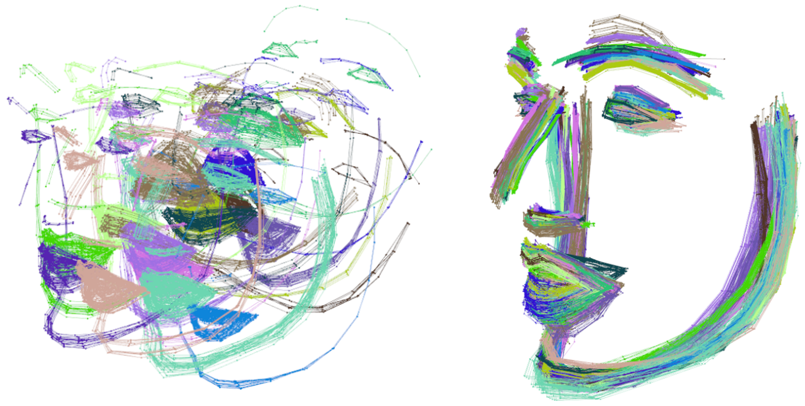
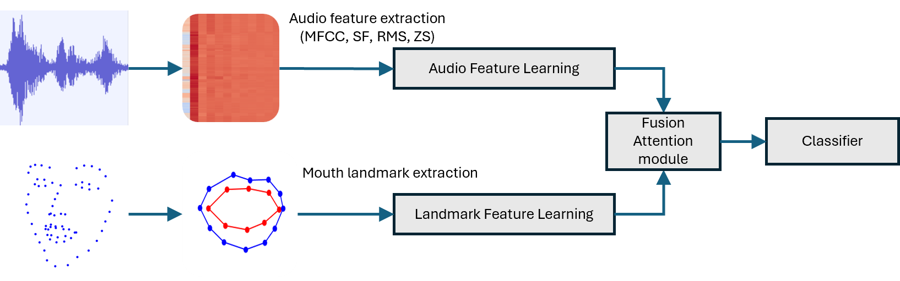

# [<h2 align='center'>CymruFluency - A Fusion Technique and a 4D Welsh Dataset for Welsh Fluency Analysis</h2>](https://doi.org/10.1007/978-3-032-07343-3_8)


[](https://huggingface.co/datasets/arvinsingh/welsh-speech-dataset)
[](https://doi.org/10.5281/zenodo.15397513)
[](https://doi.org/10.1007/978-3-032-07343-3_8)

[](https://creativecommons.org/licenses/by-nc/4.0/)

<div align='center'>
  <a href="https://www.swansea.ac.uk/staff/science-and-engineering/"><strong>Arvinder Pal Singh Bali</strong></a><sup>1</sup>
  ·
  <a href="https://sites.google.com/site/csgarykl/"><strong>Gary K.L. Tam</strong></a><sup>1</sup>
  ·
  <a href="https://www.swansea.ac.uk/staff/science-and-engineering/"><strong>Avishek Siris</strong></a><sup>1</sup>
  ·
  <a href="#"><strong>Gareth Andrews</strong></a><sup>1</sup>
  ·
  <a href="#"><strong>Yukun Lai</strong></a><sup>2</sup>
  ·
  <a href="#"><strong>Bernie Tiddeman</strong></a><sup>3</sup>
  ·
  <a href="#"><strong>Gwenno Ffrancon</strong></a><sup>4</sup>
</div>
<div align='center'>
  <sub>
    <sup>1</sup> Swansea University · 
    <sup>2</sup> Cardiff University · 
    <sup>3</sup> Aberystwyth University · 
    <sup>4</sup> Academi Hywel Teifi, Swansea University
  </sub>
</div>

> [!Note] 
> Published in *Advanced Concepts for Intelligent Vision Systems (ACIVS 2025) / Lecture Notes in Computer Science*
>
>  Full paper is avaliable [HERE.](https://cronfa.swan.ac.uk/Record/cronfa69565)

This project introduces a novel dataset and method for evaluating Welsh language fluency using multimodal fusion techniques.

### Abstract
> Welsh is a linguistically rich yet under-resourced minority language. Despite its cultural significance, automated fluency assessment remains largely unexplored due to limited datasets and tools. Existing models focus on high-resource languages, leaving Welsh without sufficient multi-modal resources. To address this, we introduce CymruFluency, the first 4D dataset for Welsh fluency assessment, capturing both audio and 3D lip movements with expert-annotated fluency scores. Building on this, we propose a multi-modal fluency classification framework that combines audio features (mel spectrograms) and manually annotated 3D lip landmarks. Our fusion approach significantly improves fluency prediction over unimodal models, emphasizing the critical role of 3D lip dynamics in Welsh learning. This research advances minority language processing by integrating articulatory features into fluency evaluation, offering a powerful tool for Welsh language learning, assessment, and preservation.
## Capture steps

### 1. Sequence capture with 3dMD machine
<p align="center">
  <table>
    <tr>
      <td align="center">
        
        <br/><b>Fluent Speaker</b>
      </td>
      <td align="center">
        
        <br/><b>Non-Fluent Speaker</b>
      </td>
    </tr>
  </table>
</p>
Note the exaggerated mouth movement in fluent speakers.

### 2. 3D reconstruction
<div align="center">
  <video style="object-fit: cover;" controls loop src="https://github.com/user-attachments/assets/140c9079-a195-4c05-aec0-7b9876048030" muted="false"></video>
  <p><strong>Subject uttering Welsh phrase “Gwybodaeth angenrheidiol” (Tr. EN: Necessary information; IPA: /ˈɡʊɨ̯bɔðaɪθ aŋɛnˈhreɪ̯djɔl/)</strong></p>
</div>

### 3. Landmarking process
<p align="center">
  
  
  <p align="center"><strong>3D mesh quality and landmarking in progress.</strong></p>
</p>

### 4. Alignment
<p align="center">
  
  
  <p align="center"><strong>Aligning landmarks to mitigate head movement.</strong></p>
</p>

## Dataset

> [!NOTE]
> Full dataset is available on [Zenodo.](https://doi.org/10.5281/zenodo.15397513)

The dataset is split in four parts and can be accessed through the four versions of the repository.
For more information on content and structure of the dataset, please read [dataset description.](./DATASET.md)

## Installation

1. Clone this repo:
    ```bash
    git clone https://github.com/arvinsingh/CymruFluency.git
    cd CymruFluency
    ```

2. Install dependencies:
    ```bash
    uv sync
    ```

3. Launch the notebooks:
    ```bash
    jupyter notebook
    ```

## Notebooks Overview

- `Data Exploration and Analysis.ipynb` - Visualize and explore dataset stats  
- `Experiment Audio Landmarks.ipynb` - Train and eval unimodal models  
- `Experiment Model Training.ipynb` - Train and eval multimodal models  
- `Welsh vs English.ipynb` - Comparative study of fluency in Welsh vs English dataset

<p align="center">
  
  
  <p align="center"><strong>Architecture Pipeline.</strong></p>
</p>

## License

This dataset is licensed under a [Creative Commons Attribution-NonCommercial 4.0 International License.](LICENSE)

Research purposes only.

## Citation [Pending publication]

> [!important]
> If you use our dataset and code, please use the following two bibtex for citation:

```bibtex
@inproceedings{bali_2026_cymrufluency,
  author       = {Bali, Arvinder Pal Singh and
                  Tam, Gary KL and
                  Siris, Avishek and
                  Andrews, Gareth and
                  Lai, Yukun and
                  Tiddeman, Bernie and
                  Ffrancon, Gwenno},
  editor       = {Blanc-Talon, Jacques and
                  Delmas, Patrice and
                  Takahashi, Hiroki and
                  Minami, Yasuhiro},
  title        = {CymruFluency - A Fusion Technique and a 4D Welsh Dataset for Welsh Fluency Analysis},
  booktitle    = {Advanced Concepts for Intelligent Vision Systems},
  pages        = {96--108},
  year         = 2026,
  publisher    = {Springer Nature Switzerland},
  address      = {Cham},
  isbn         = {978-3-032-07343-3},
  doi          = {10.1007/978-3-032-07343-3_8},
  url          = {https://doi.org/10.1007/978-3-032-07343-3_8},
}


```

```bibtex
@dataset{bali_2025_dataset,
  author       = {Bali, Arvinder Pal Singh and
                  Tam, Gary KL and
                  Siris, Avishek and
                  Andrews, Gareth and
                  Lai, Yukun and
                  Tiddeman, Bernie and
                  Ffrancon, Gwenno},
  title        = {Dataset and code for "CymruFluency - A fusion technique and a 4D Welsh dataset for Welsh fluency analysis"},
  month        = may,
  year         = 2025,
  publisher    = {Zenodo},
  doi          = {10.5281/zenodo.15397513},
  url          = {https://doi.org/10.5281/zenodo.15397513},
}
```


## Acknowledgement

This is part of a major ongoing project led by Dr Gary K.L. Tam.

This research was supported by Coleg Cymraeg Cenedlaethol Small Grant 2017, Cherish-DE Escalator Fund 2019, 2021(1RR, 52E), Swansea University SPIN fund, Wales Network Innovation Small Grant 2023 and EPSRC IAA Fund 2024. We would like to thank all annotators and anonymized participants for their contributions to this project.

[](https://creativecommons.org/licenses/by-nc/4.0/)
